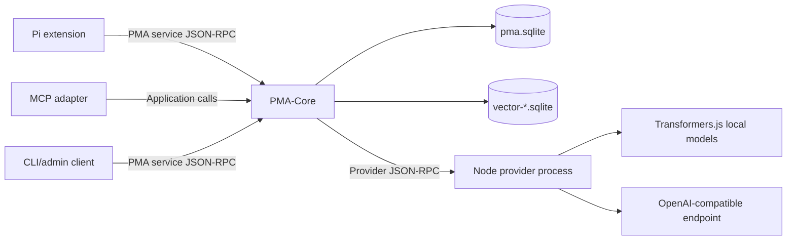

# System architecture

## Runtime components



PMA-Core owns evidence capture, validation, graph storage, retrieval, vector projection coordination, jobs, and audit history. External providers perform embeddings or structured generation. Host adapters map external lifecycle events into the [PMA service protocol](../04-interfaces/SERVICE_PROTOCOL.md).

## Layering

```text
Transport adapters
    JSON-RPC stdio, Pi, MCP, CLI
Application services
    Observe, process, recall, inspect, correct, vector management
Domain
    Evidence, claims, entities, operations, activation, consolidation
Storage
    SQLite core, FTS5, vector projections, migrations
Provider clients
    External process management and capability calls
```

Transport code must not contain memory semantics. Storage code must not call providers. Provider output must enter through application validation rather than writing tables directly.

## Process topology

The MVP uses host-managed child processes:

- Pi launches or connects to `pma-core serve --stdio`.
- PMA-Core launches a configured provider process and communicates over stdio.
- `pma-core mcp --stdio` hosts the MCP adapter through the same application layer.

A persistent user daemon and socket transport are deferred. The protocol must not depend on stdio so those transports can be added later.

## Availability model

PMA-Core remains useful when providers fail:

- Evidence capture continues.
- FTS5 and graph retrieval continue.
- Existing compatible vectors remain queryable.
- New embedding and extraction work is queued.
- Structured consolidation waits rather than inventing deterministic replacements.

## Data authority

- `pma.sqlite` is authoritative.
- Vector files are rebuildable materialized projections.
- Pi session JSONL is external evidence, not canonical memory.
- Provider caches and model files are runtime artifacts, not PMA knowledge.
- ContextPacket records explain retrieval but are not semantic memories.

## Cross-platform constraints

All core filesystem paths use `std::filesystem`; protocol paths use UTF-8 strings and explicit path-kind metadata. Platform-specific process handling is isolated behind a small abstraction. See [Dependencies and build](../05-implementation/DEPENDENCIES_AND_BUILD.md).
